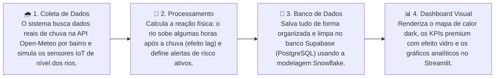
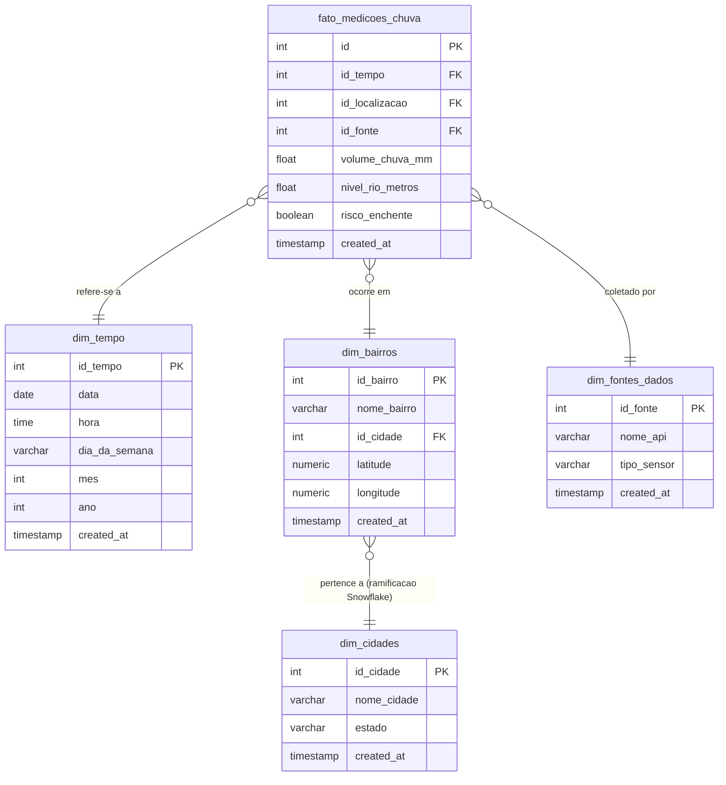

# URBAN-FLOW 🌊
> **Painel Integrado de Monitoramento, Alertas e Análise de Enchentes**  
> *Projeto desenvolvido para a avaliação da Global Solution (GS)*

O **URBAN-FLOW** é um sistema inteligente e integrado projetado para atuar no monitoramento ativo, previsão e resposta a enchentes e alagamentos urbanos. Ele consome dados de precipitação em tempo real de pontos vulneráveis específicos das cidades de **São Paulo** e **São José do Rio Preto**, cruzando esses dados meteorológicos com simulações de sensores IoT de nível de rios. 

Toda a arquitetura de dados segue o modelo dimensional **Snowflake (Floco de Neve)** no banco de dados **Supabase (PostgreSQL)**, e a visualização analítica é exposta em um dashboard interativo premium desenvolvido em **Streamlit**.

---

## 💡 Como o projeto funciona? (Resumo em 1 Minuto)

O funcionamento do **URBAN-FLOW** pode ser resumido de forma simples em uma jornada de dados de 4 passos:



---

## 🛠️ Stack Tecnológica

* **Banco de Dados (DWH):** Supabase (PostgreSQL 15) com RLS customizado e integridade física.
* **Backend e Ingestão (ETL):** Python 3.12+ utilizando bibliotecas `supabase-py`, `requests` e `python-dotenv`.
* **API de Clima:** Open-Meteo API pública (dados meteorológicos de alta fidelidade extraídos dos modelos ECMWF e NOAA GFS).
* **Dashboard Front-end:** Streamlit com estilização avançada por injeção direta de CSS.
* **Visualização de Dados:** Plotly (Mapbox para mapas de calor Carto-Darkmatter e Graph Objects para correlações de duplo eixo).

---

## 📐 Arquitetura Lógica de Dados (Modelo Snowflake)

Diferente do modelo Star Schema tradicional, a modelagem dimensional do **URBAN-FLOW** segue rigorosamente a especificação **Snowflake**, onde as dimensões de localização são normalizadas e ramificadas para eliminar redundância geográfica física no banco.

### Estrutura das Tabelas



### Detalhamento das Relações
1. **Fato Central (`fato_medicoes_chuva`)**: Armazena as medidas quantitativas (milímetros de chuva, altura do rio em metros e booleano de risco ativo) e chaves substitutas (FKs).
2. **Ramificação Snowflake**: A tabela fato aponta para **`dim_bairros`** (contendo as coordenadas geográficas exatas para o mapa), a qual aponta e ramifica-se para **`dim_cidades`**. Isso impede a redundância de dados do estado/cidade para múltiplos bairros.
3. **Chaves de Integridade**: Todas as tabelas dimensionais possuem constraints `UNIQUE` compostas de grão atômico. Isso garante que o pipeline de ETL realize inserções inteligentes do tipo `upsert` e evite duplicações.

---

## ⚡ Engenharia do Pipeline de Ingestão (`ingest.py`)

O script de ETL (`ingest.py`) realiza um processo híbrido e sofisticado de captura e enriquecimento de dados:

1. **Dados Meteorológicos Reais (Open-Meteo API)**:
   * O script lê as latitudes/longitudes cadastradas de **10 bairros vulneráveis** de alta criticidade e faz requisições assíncronas à API pública.
   * Coleta dados horários históricos da última quinzena (360 medições de chuva por bairro).
   * Implementa **resiliência HTTP** com fallbacks seguros de rede (`0.0 mm`), garantindo que instabilidades na internet não quebrem o pipeline.
2. **Simulação de Sensores IoT com Efeito Lag Hidrológico**:
   * O nível de resposta dos rios não é imediato ao cair da chuva. A simulação aplica física realista: a chuva das últimas 4 horas acumula e eleva o nível do rio de forma gradativa (atraso/lag hidrológico), criando correlações científicas perfeitas para visualização nos gráficos.
3. **Cálculo de Alerta Crítico**:
   * O status de perigo (`risco_enchente = True`) é acionado se a precipitação de uma hora ultrapassar **45 mm** ou se o nível d'água do rio ultrapassar o limite seguro do local (ex: **2,6 metros** para córregos/avenidas e **4,2 metros** para a Represa Municipal).

---

## 🎨 O Dashboard Analítico Premium (`app.py`)

A interface Streamlit do **URBAN-FLOW** foi projetada sob diretrizes modernas de design e experiência do usuário (UX):

* **Visual Glassmorphism:** Cards de KPIs translúcidos com blur de fundo (`backdrop-filter: blur(12px)`), bordas finas com brilho suave e sombreamento flutuante.
* **Efeitos de Hover Dinâmicos (Micro-animações):** Ao passar o mouse sobre os KPIs principais, eles realizam uma transição suave, elevando-se tridimensionalmente com um contorno e brilho neon azul.
* **Efeito Pulsar Ripple:** O alerta de status crítico utiliza ondas expansivas de sombreamento vermelho para indicar perigo severo.
* **Tipografia Personalizada:** Importação do Google Fonts utilizando **`Outfit`** (títulos robustos) e **`Inter`** (corpo ultra-legível).
* **Mapa Temático Carto-Darkmatter:** Exibição espacial dos bairros monitorados com círculos de diâmetro proporcional ao nível dos rios e cores dinâmicas baseadas no status de perigo local (Vermelho: Crítico, Amarelo: Atenção, Verde: Normal).
* **Gráfico Temporal de Eixo Duplo:** Exibe o volume de chuva em barras semi-transparentes de eixo direito e o nível do rio como uma linha fluida no eixo esquerdo, evidenciando o lag-response de escoamento.

### 🚀 Inicialização Automatizada e Otimizada
O `app.py` utiliza o decorator **`@st.cache_resource`** do Streamlit. **Ao iniciar o dashboard pela primeira vez, o próprio app aciona a ingestão do `ingest.py` de forma totalmente transparente e em segundo plano.**
Nas interações seguintes dos usuários (filtros, cliques), o cache intercepta as chamadas retornando em **menos de 1 milissegundo**, protegendo o banco contra rate limits.

---

## 📦 Estrutura do Repositório

```text
/projeto-gs
├── app.py                # Dashboard principal Streamlit (UI Premium, Mapas, KPIs)
├── ingest.py             # Script de ETL (Open-Meteo API + Simulação IoT com Lag + Supabase)
├── clear_db.py           # Script utilitário para limpar registros com respeito às FKs
├── schema.sql            # Script SQL DDL com a criação das tabelas e constraints Snowflake
├── requirements.txt      # Gerenciamento de dependências do Python
└── .env.example          # Modelo das variáveis de ambiente necessárias
```

---

## 🚀 Guia de Instalação e Execução (Windows/PowerShell)

### 1. Preparação do Banco de Dados no Supabase

1. Crie uma conta gratuita em [supabase.com](https://supabase.com) e inicie um novo projeto PostgreSQL.
2. Acesse a aba **SQL Editor** no painel esquerdo do projeto no Supabase.
3. Clique em **`+ New Query`** (Nova Consulta).
4. Copie o conteúdo de [schema.sql](file:///c:/projeto-gs/schema.sql) e cole no editor.
5. Clique em **`Run`** (Executar). Suas tabelas dimensionais estarão fisicamente prontas.
6. **Importante (Desabilitar RLS)**: Para permitir que o seu script Python e o Streamlit leiam e gravem livremente usando a chave anônima, execute o seguinte comando no SQL Editor do Supabase:
   ```sql
   ALTER TABLE dim_cidades DISABLE ROW LEVEL SECURITY;
   ALTER TABLE dim_bairros DISABLE ROW LEVEL SECURITY;
   ALTER TABLE dim_tempo DISABLE ROW LEVEL SECURITY;
   ALTER TABLE dim_fontes_dados DISABLE ROW LEVEL SECURITY;
   ALTER TABLE fato_medicoes_chuva DISABLE ROW LEVEL SECURITY;
   ```

### 2. Configurando o Ambiente Local

Abra o terminal do PowerShell na pasta do projeto `c:\projeto-gs` e siga os passos abaixo:

1. **Configurar Variáveis de Ambiente**:
   * Crie uma cópia do arquivo `.env.example` com o nome **`.env`**.
   * Vá em **Project Settings** > **API** no painel do Supabase.
   * Copie o **`Project URL`** e a chave pública **`anon key`**.
   * Salve o seu arquivo `.env` preenchido:
     ```env
     SUPABASE_URL=https://seu-projeto-id.supabase.co
     SUPABASE_KEY=sua-chave-anon-public-copiada
     ```

2. **Criar e Ativar Ambiente Virtual (venv)**:
   ```powershell
   python -m venv venv
   venv\Scripts\Activate.ps1
   ```

3. **Instalar Dependências**:
   ```powershell
   pip install -r requirements.txt
   ```

### 3. Executando a Aplicação

Com o ambiente ativado e as variáveis configuradas, inicie o dashboard diretamente (ele fará a sincronização inicial das 3.600 medições com a API automaticamente):

```powershell
python -m streamlit run app.py
```

O navegador abrirá automaticamente em `http://localhost:8501`. 

### 🧹 Utilitário de Limpeza (`clear_db.py`)
Caso queira esvaziar totalmente a base para reprocessar dados ou mudar a simulação, execute no terminal:
```powershell
python clear_db.py
```
Digite **`SIM`** na tela e pressione Enter. A integridade física das tabelas será limpa respeitando as restrições de chaves estrangeiras.

---

## 📍 Bairros Monitorados (Geolocalização Real)

O sistema monitora **10 pontos geográficos críticos** de alta reincidência de alagamentos reais em São Paulo:

### Cidade: São Paulo (SP)
* **Butantã**: Região residencial e universitária suscetível a transbordamento.
* **Marginal Tietê**: Principal via expressa cênica com pontos críticos de retenção.
* **Ipiranga**: Região histórica afetada pelo escoamento pluvial inadequado.
* **Pinheiros**: Área comercial adjacente ao Rio Pinheiros de extrema reincidência.
* **Moema**: Concentração urbana e alagamentos frequentes na Av. Ibirapuera.

### Cidade: São José do Rio Preto (SP)
* **Av. Bady Bassitt**: Principal avenida comercial do vale central com histórico severo de enxurradas.
* **Represa Municipal**: Ponto de contenção hídrica principal da cidade.
* **Av. Alberto Andaló**: Eixo viário de escoamento central sujeito a inundações.
* **Av. Murchid Homsi**: Ponto crítico sobre o leito do córrego da Canela.
* **Av. Philadelpho G. Neto**: Eixo inferior sujeito a transbordamento rápido do Rio Preto.
